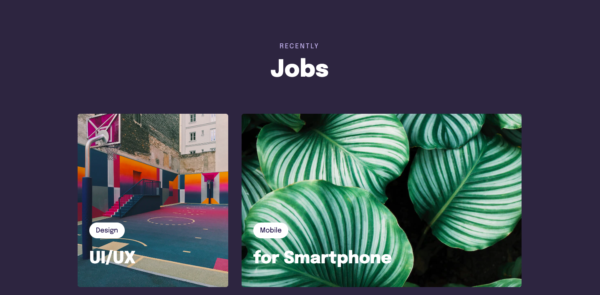

<h1 align="center"> Layout Project - Grid - CSS </h1>

  <a href="#-tecnologias">Technology</a>&nbsp;&nbsp;&nbsp;|&nbsp;&nbsp;&nbsp;
  <a href="#-projeto">Project</a>&nbsp;&nbsp;&nbsp;|&nbsp;&nbsp;&nbsp;
  <a href="#-layout">Layout</a>&nbsp;&nbsp;&nbsp;|&nbsp;&nbsp;&nbsp;
  <a href="#memo-licença">License</a>

 

  

## 🚀 Technology

This project was developed with the technologies below:

- HTML and CSS
- Git and Github
- Figma

## 💻 Project

The project was made to develop the skills with CSS 

## 🔖 Layout

You can see the laytout throught [THIS LINK](https://www.figma.com/file/I7EUPFFzpBD4ByLLapKOQh/Stage-03---Formul%C3%A1rio-intermedi%C3%A1rio-(Copy)?node-id=3%3A4&t=vTWfivBjeW51MsnM-0). necessary has the [Figma] account (https://figma.com) to access.

## :memo: License

This project is above the MIT license.

---

 Made  ♥  by Gustavo Zonta
